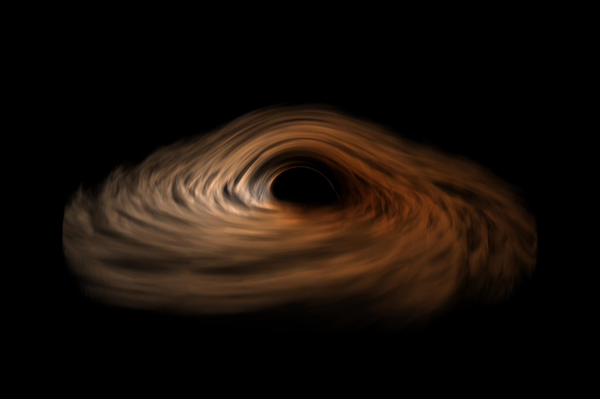

(WIP)

# Relativistic-renderer

C++ code for rendering relativistic effects in arbitrary spacetimes. The focus is on rendering rotating black holes, described by the Kerr metric.

## The physics

A relativistic renderer traces geodesics. These are the paths through spacetime followed by any free-falling particle, and they maximize the time that an observer following the path measures.

We model geodesics using the [geodesic equation](https://en.wikipedia.org/wiki/Geodesics_in_general_relativity):

$$
\begin{equation}
    \frac{d^2 x^\mu}{d\lambda^2} + \Gamma^\mu_{\rho \sigma} \frac{dx^\rho}{d\lambda} \frac{dx^\sigma}{d\lambda} = 0
\end{equation}
$$

for $\mu = 0, 1, 2, 3$. 

#### The numerical integration scheme

In $n$-dimensional spacetime the geodesic equation produces $n$ coupled, second order, ordinary differential equations. Solving these equations is not any different from solving any other set of coupled differential equations - one can apply a standard numerical integration scheme. An important consideration here, though, is we are going to be running into coordinate singularities when nearing the event horizon of the black holes we render. So the numerical scheme one chooses has to be robust enough to properly handle those divergences. We will also encounter a coordinate singularity $\theta = 0$ at the vertical axis, which will produce similar effects. 

Here I've used the [Runge-Kutta-Fehlberg](https://en.wikipedia.org/wiki/Runge%E2%80%93Kutta%E2%80%93Fehlberg_method) (RKF45) method to solve the differential equations, rather than for example 4th order Runge-Kutta or some implicit scheme. This is mostly because RKF45 has a particularly useful way of estimating the numerical error introduced by the integration scheme, and using this estimated error to choose a new appropriate step size. This adaptive step size becomes small when the derivatives of our variables are large, so it very naturally takes care of the coordinate singularities. In particular, we completely get rid of the otherwise present artifact at the vertical axis when using RKF45. 

### Project structure

- `metric.cpp`: Defines the base `Metric` class from which all other metric classes derive. Defines the methods for implementing the RKF45 integration scheme, coordinate transformations between Cartesian and spherical/Boyer-Lindquist coordinates, function for computing the $\mu = 0$ component of a four-vector given its $\mu = 1, 2, 3$ components. This `Metric` class can also be used directly, in which case we are desccribing Minkowski spacetime. 

- `kerr.cpp`: Defines the `Kerr` class which derives from the `Metric` class. This specializes a lot of the functions from the `Metric` class to Kerr spacetime. This includes the components of the metric tensor, the right-hand side (rhs) of the geodesic equation and the coordinate transformation functions.

- `schwarzschild.cpp`: Completely analogous to the `Kerr` class, the `Schwarzschild` class also derives from the `Metric` class, and describes Schwarzschild spacetime. 

- `scene.cpp`: Defines the `Scene` class, which has methods for initializing and simulating the camera rays. 

- `colorCalculator.cpp`: Defines the `ColorCalculator` class, which has methods for computing the RGB color of a blackbody at a given temperature $T$. 

Instead of defining the position of the camera, its direction, the parameters of the metric etc. inside the code, I use `.json` files to specify all of this. I call these *scene files*, and a given scene fully specifies the state of the simulation. In `src/main.cpp` I read in a scene file and use it to define all of the simulation settings. Although this clutters `main.cpp` it makes it significantly easier to change between simulations, because I can just save different simulation settings in different scene files, and change between them in `main.cpp` by just changing which scene file to read. I have also crated a `scene_template.json` file which shows the structure the code is expecting the scene files to take, together with a description of what each of the parameters describes. 

The `main.cpp` code then initializes a `scene` object from `scene.cpp` (slightly confusing, because this `scene` is not directly related to the scene files themselves. Should change name), which has methods for initializing the rays from the camera and solving the geodesic equation for each of these. `Scene::simulate_camera_rays` contains the main render loop. The generated image is then saved to file in `main.cpp`. 

---

The code is built using `cmake build` and run using `./out/build/Relativistic-renderer/Relativistic-renderer.exe`. 